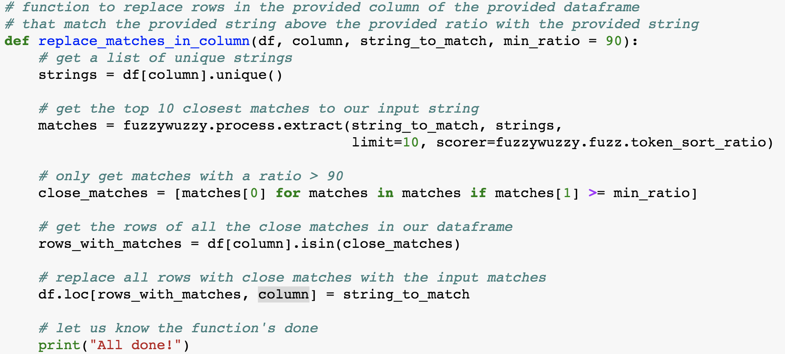

# 5 Day Data Cleaning Challenge by Kaggle 
  
  
#### __This folder contains all the cource code and notes regarding Data Cleaning.__ 
  
  
## Notes 
 
### Day 1: Handling missing values 
* [`df.sample()`](https://pandas.pydata.org/pandas-docs/stable/generated/pandas.DataFrame.sample.html) 
* `df.isnull().sum().sum()` 
* [`df.dropna()`](https://pandas.pydata.org/pandas-docs/stable/generated/pandas.DataFrame.dropna.html#pandas.DataFrame.dropna)
* [`df.fillna()`](https://pandas.pydata.org/pandas-docs/stable/generated/pandas.DataFrame.fillna.html#pandas.DataFrame.fillna) 
* `df.fillna(method = 'bfill', axis=0).fillna(0)` 

### Day 2: Scaling and Normalization 
* In __Scaling__, you're changing the range of your data while in __Normalization__ you're changing the shape of the distribution of your data. 
* Scaling: transforming your data so that it fits within a specific scale, like 0-100 or 0-1. You want to scale data when you're using methods based on measures of how far apart data points, like support vector machines, or SVM or k-nearest neighbors, or KNN. With these algorithms, a change of "1" in any numeric feature is given the same importance. 
* Normalization: The point of normalization is to change your observations so that they can be described as a normal distribution. In general, you'll only want to normalize your data if you're going to be using a machine learning or statistics technique that assumes your data is normally distributed. Some examples of these include t-tests, ANOVAs, linear regression, linear discriminant analysis (LDA) and Gaussian naive Bayes. 
* [`minmax_scaling() from mlxtend.preprocessing`](http://rasbt.github.io/mlxtend/api_subpackages/mlxtend.preprocessing/#minmax_scaling) 
* [Box Cox Transformation](https://en.wikipedia.org/wiki/Power_transform#Box%E2%80%93Cox_transformation) 
* [`boxcox() from scipy.stats`](https://docs.scipy.org/doc/scipy/reference/generated/scipy.stats.boxcox.html) 

### Day 3: Parsing Dates 
* `pd.to_datetime(landslides['date'], format = "%m/%d/%y")`
* `pd.to_datetime(landslides['Date'], infer_datetime_format=True)` 
* `landslides['date_parsed'].dt.day` 

### Day 4: Character Encodings 
* UTF-8 is the standard text encoding. All Python code is in UTF-8 and, ideally, all your data should be as well. 
* `str.encode("utf-8", errors = "replace")` 
* `str.decode("utf-8")` 
* `chardet.detect(file.read(1000))` 

### Day 5: Inconsistent Data Entry 
 

